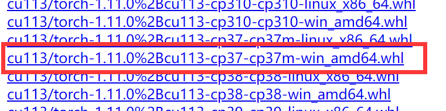

# homework_CIFAR10
## 1.运行环境搭建
- win11 + anaconda3 + python 3.7 + cuda11.3 + torch 11.0
- torch资源包：https://download.pytorch.org/whl/torch_stable.html 选择
- torchvison安装：pip install torchvision==0.12.0
## 2.运行