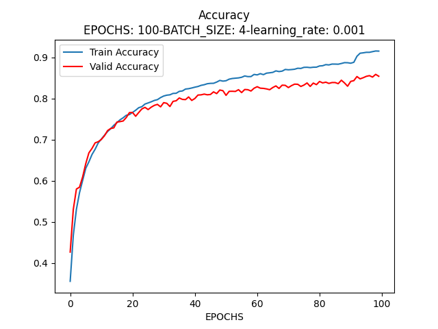
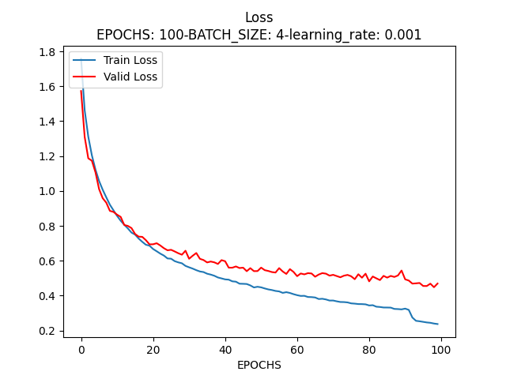
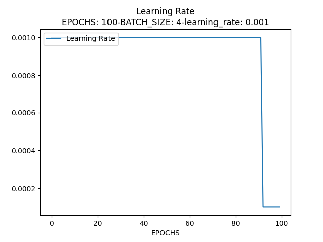

# homework_CIFAR10

## Installation
### Step 1: Clone the Code from Github
```bash
git clone https://github.com/hhy-hook/homework_CIFAR10.git
cd homework_CIFAR10/
```
### Step 2: Install Requirements
Python: see requirement.txt for complete list of used packages. We recommend doing a clean installation of requirements using virtualenv:
```bash
conda create -n envname python=3.7
conda activate envname
pip install -r requirement.txt 
```
## Running Task
```bash
$ python ./main.py
```
## Result
超参数设置
- EPOCHS = 100
- BATCH_SIZE = 4 | 8 | 16 | 32 | 64 | 128 | 256
- learning_rate = 0.01 | 0.001  采用ReduceLROnPlateau修正学习率
---
+ learning_rate = 0.01

训练结果

| BATCH_SIZE |     train_loss | train_acc |   eval_loss | eval_acc |
|------------|---------------:|----------:|------------:|---------:|
| 4          |         0.6349 |    0.7966 |      0.6793 |   0.7883 |
| 8          |         0.1522 |    0.8874 |      0.5312 |   0.8356 |
| 16         |         0.1323 |    0.9201 |      0.4812 |   0.8567 |
| 32         |         0.1301 |    0.9264 |      0.4830 |   0.8531 |
| 64         |         0.1269 |    0.9386 |      0.4773 |   0.8604 |
| 128        |         0.1773 |    0.9380 |      0.4547 |   0.8638 |
| 256        |         0.2438 |    0.9134 |      0.4882 |   0.8455 |

从表格可以看出：随BATCH_SIZE增加，模型逐渐出现过拟合的情况（可能因为网络结构相对简单导致）

以BATCH_SIZE=128为例：


---
+ learning_rate = 0.001

| BATCH_SIZE |   train_loss |     train_acc |   eval_loss | eval_acc |
|------------|-------------:|--------------:|------------:|---------:|
| 4          |       0.2400 |        0.9153 |      0.4482 |   0.8585 |
| 8          |       0.2343 |        0.9161 |      0.4303 |   0.8635 |    
| 16         |       0.1996 |        0.9288 |      0.4448 |   0.8624 |
| 32         |       0.2884 |        0.8986 |      0.4945 |   0.8422 |
| 64         |       0.3136 |        0.8888 |      0.5008 |   0.8343 |
| 128        |       0.3676 |        0.8708 |      0.5531 |   0.8166 |
| 256        |       0.4154 |        0.8540 |      0.5818 |   0.8002 |

以BATCH_SIZE=4为例：




## Structs
```
homework
|
| img.png
|
| main.py #主要运行程序
|
| net.py #网络结构
|
└───dataset #下载数据集(运行下载后，结构如下)
|   |
|   └─── cifar-10-batches-py
|   └─── cifar-10-python.tar.gz
```
## Help
- win11 + anaconda3 + python 3.7 + cuda11.3 + torch 1.10.0
- torch资源包：https://download.pytorch.org/whl/torch_stable.html 选择
- torchvison安装：pip install torchvision==0.12.0
### 1.torch资源包安装
```bash
$ conda activate YOUR_CONDA_ENV(homework_CIFAR10)
$ cd whl目录
$ pip install torch-1.10.0+cu113-cp37-cp37m-win_amd64.whl
```
### 2.如果出现torch和torchvision版本不匹配问题
```bash
# 通过pycharm删除torchvision单个库
$ pip install torchvision==0.12.0 -i https://pypi.tuna.tsinghua.edu.cn/simple
```


